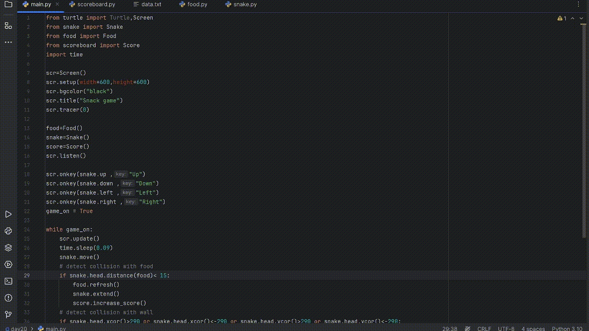

# Snake Game 🐍

A classic Snake game built in Python using turtle graphics and object-oriented programming (OOP).

## Overview

This project recreates the nostalgic Snake game where the objective is to control a snake to eat food and grow longer without colliding with walls or itself. The game is built with Python's turtle graphics library and demonstrates the principles of object-oriented programming through well-organized code.

## Demo

## Features

- **Object-Oriented Design**: The game is structured using classes for each component—`Snake`, `Food`, and `Score`—making the code modular and easy to manage.
- **Simple Controls**: Move the snake using the arrow keys on your keyboard.
- **Score Tracking**: The game keeps track of your score, which resets whenever the snake collides with a wall or itself.

## How to Play

- **Objective**: Control the snake to eat the food that appears randomly on the screen. Each time the snake eats, it grows, and your score increases.

- **Controls**:
  - Up Arrow: Move up
  - Down Arrow: Move down
  - Left Arrow: Move left
  - Right Arrow: Move right

- **Game Over Conditions**: Collision with the wall or with the snake's own tail will reset the score and the snake's length.

## Requirements

- Python 3.x
- `turtle` library (comes pre-installed with Python)

## File Structure

- `main.py`: The main script that initializes the game window, listens for keyboard inputs, and manages the game loop.
- `snake.py`: Contains the `Snake` class, which handles snake movement, growth, and resetting.
- `food.py`: Contains the `Food` class, which generates food at random positions for the snake to eat.
- `scoreboard.py`: Contains the `Score` class, which manages the score display and reset functionality.

## License

This project is open source and available under the MIT License.
